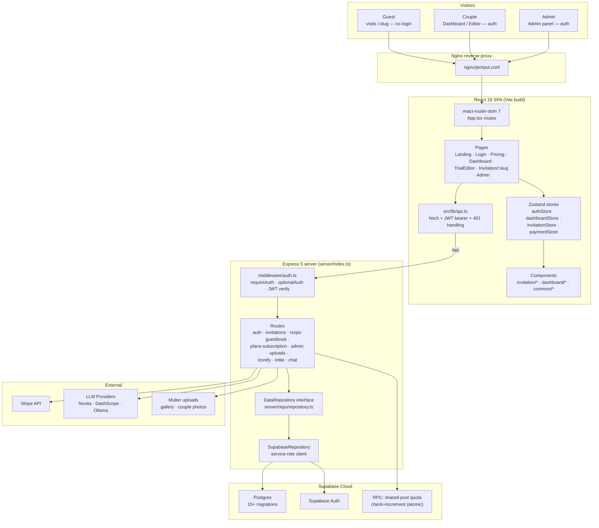
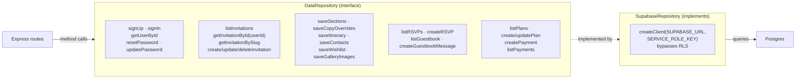
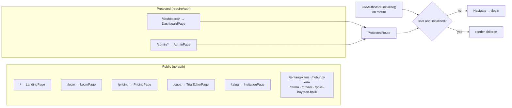
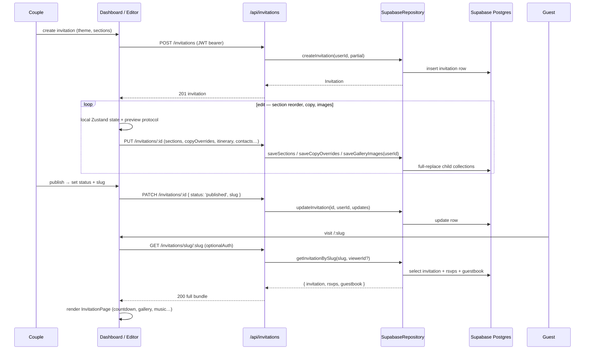
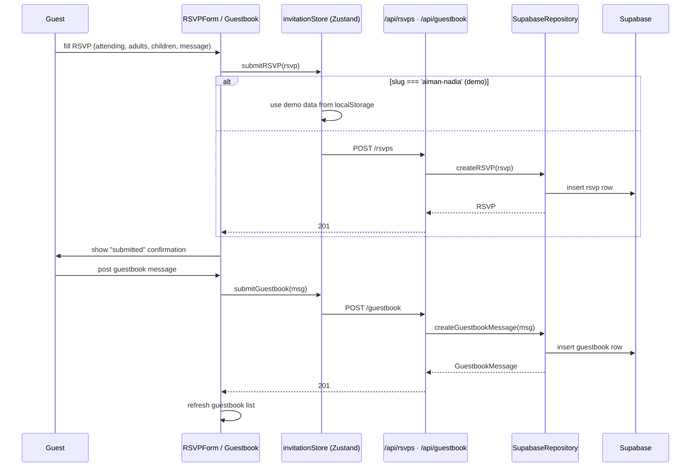
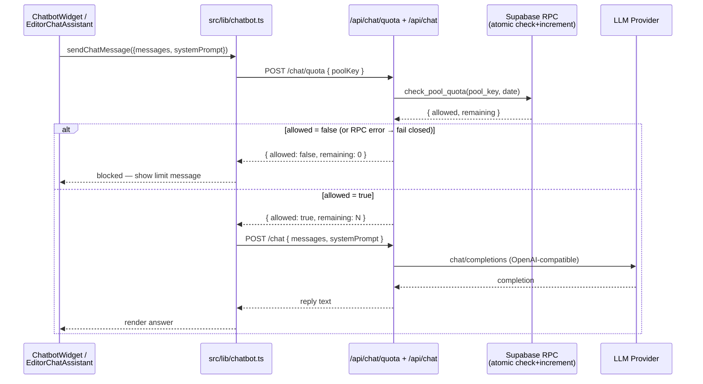
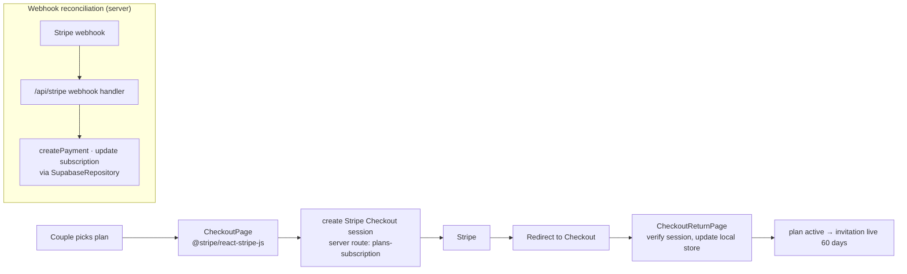
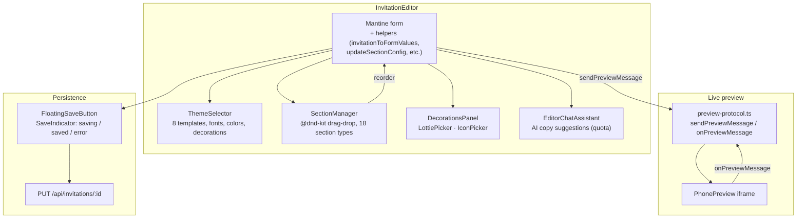
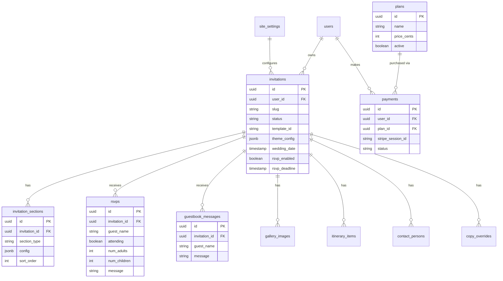
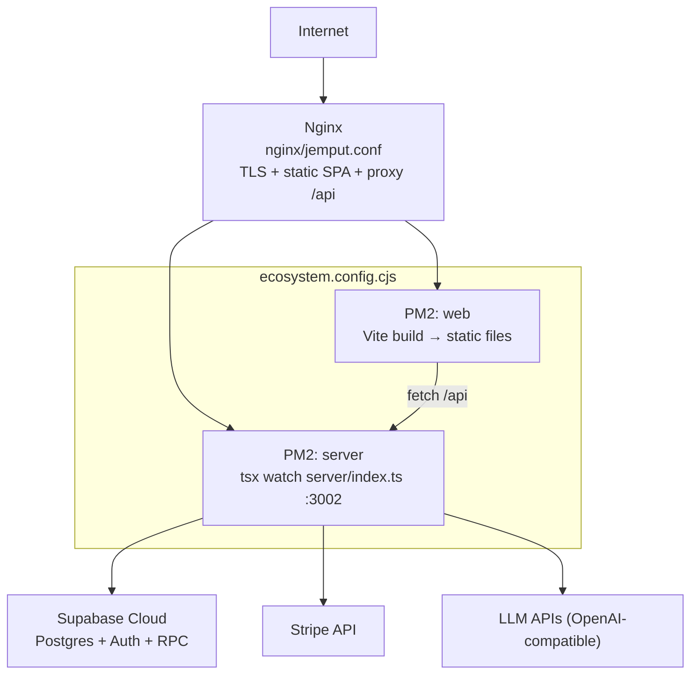

# Neyobytes Jemput — Architecture

> **Private project** — source code is not public. This document is hosted in the [`hazrid93/hazrid93`](https://github.com/hazrid93/hazrid93) profile repository so visitors can understand the architecture without needing repo access. Live site: **[jemput.neyobytes.com](https://jemput.neyobytes.com/)**

A digital wedding invitation (kad kahwin) platform for the Malaysian market. Couples sign up, build themed invitations through a drag-and-drop editor, publish them to a shareable slug (`jemput.neyobytes.com/<slug>`), and guests interact (RSVP, guestbook, AI chatbot) without an account. Stripe handles tiered subscriptions.

| | |
|---|---|
| **Frontend** | React 19 · TypeScript · Vite · React Router 7 · Mantine UI · Zustand · Framer Motion |
| **Backend** | Express 5 · TypeScript · `tsx` runtime · Helmet · rate-limit |
| **Database** | Supabase (Postgres) — service-role client, auth enforced in repository layer (not RLS) |
| **Auth** | Supabase Auth (client) + JWT issued by server (`jsonwebtoken`) · `requireAuth` / `optionalAuth` middleware |
| **Payments** | Stripe (one-time, tiered plans: Asas / Premium) · 60-day active duration |
| **AI Chatbot** | OpenAI-compatible API — Novita AI · Alibaba DashScope · Ollama · shared-pool daily quota (RPC) |
| **Editor** | `@dnd-kit` drag-and-drop · 8 theme templates · 18 section types · live phone preview · AI editor assistant |
| **Process** | PM2 (`ecosystem.config.cjs`) · Nginx (`nginx/jemput.conf`) |

---

## High-Level Architecture

---

## Repository Pattern — The DB Swap Seam

Every route handler calls methods on the `DataRepository` interface — never the Supabase client directly. Today's implementation is `SupabaseRepository`; a future `PostgresRepository` can be swapped by changing one line in `server/index.ts`. **Authorization is enforced in the repository, not in RLS** — every user-owned method takes a `userId` and filters by it.

---

## Frontend Route Map

`src/App.tsx` — lazy-loaded pages behind `ProtectedRoute` (redirects to `/login` if `authStore.user` is null once initialized).

---

## Invitation Lifecycle

---

## RSVP + Guestbook Flow (public, no login)

---

## AI Chatbot — Shared-Pool Quota

The invitation chatbot (premium) and the editor AI assistant both use a **shared-pool daily quota** enforced by an atomic Supabase RPC. The client fails **closed** — if the quota check errors, the request is blocked (never allowed through).

**Quota keys:** `invitation:<id>` for the public chatbot, `cuba_editor` / `editor` for the in-editor assistant. The daily limit is resolved server-side from `site_settings` — the client cannot inflate it.

---

## Payments & Subscription

**Plans:** Asas (free trial tier) / Premium (paid). Payment status tracked per invitation (`free` / `paid` / `expired`). Active duration: 60 days from payment.

---

## Editor Architecture

`src/components/dashboard/InvitationEditor.tsx` is the core builder. It uses a preview-protocol (`src/lib/preview-protocol.ts`) to bridge the editor form state with the live phone preview iframe.

**Trial mode:** `TrialEditorPage` (`/cuba`) stores the invitation in `localStorage` (`TRIAL_PREVIEW_STORAGE_KEY`) — no account or server round-trip needed. Demo slug `aiman-nadia` renders `demoInvitation` data, allowing the editor to be explored without signup.

---

## Data Model (key tables)

Migrations live in `supabase/` (16 numbered files). Authorization is enforced in the repository layer.

---

## Deployment Topology

*PM2 runs the Express server (`tsx`) and serves the Vite-built SPA as static files. Nginx terminates TLS, serves the SPA, and proxies `/api/*` to the server. The server talks to Supabase (service-role), Stripe, and LLM providers.*

---
## Key Features & Highlights

Jemput is a premium Malaysian digital wedding-invitation platform (Express + React + Supabase + Stripe) with a live preview editor, AI guest chatbot, RSVP/guestbook management, and a multi-layered subscription/quota system. The notable aspects below are grounded in the actual source — Postgres RPCs, migration files, the repository seam, and the iframe preview protocol.

- **Atomic shared-pool chatbot quota via a Postgres `SECURITY DEFINER` RPC** — The daily AI chat limit is enforced by `public.check_and_increment_chat_quota(p_pool_key, p_daily_limit)` in `supabase/migration-3.sql` (hardened in `migration-8.sql`). It is genuinely atomic because it performs `INSERT ... ON CONFLICT DO NOTHING` to create today's row, then `SELECT ... FOR UPDATE` to lock the row, then checks `v_count >= v_resolved_limit` and only increments if allowed — all inside one transaction, returning `{allowed, remaining, used}` as jsonb. The daily limit is resolved server-side from `site_settings` (e.g. `invitation_chat_daily_limit`, `cuba_editor_chat_daily_limit`) keyed by pool name, never trusted from the client; `migration-6` rewrote it so the limit comes from the DB and uses `LEAST(p_daily_limit, v_site_limit)` for backward compat. `migration-6` also dropped the permissive `INSERT/UPDATE` RLS policies on `chatbot_pool_usage` so the only write path is the `SECURITY DEFINER` function. The client (`src/lib/chatbot.ts`, `checkPoolQuota`) **fails closed** — any quota-check error returns `{allowed:false, remaining:0}` rather than letting a chat through.

- **Multi-provider LLM proxy with provider-specific reasoning knobs** — `server/index.ts` exposes `POST /api/chat`, hiding the LLM API key from the browser entirely. It supports six provider presets in `LLM_PROVIDER_DEFAULTS` (novita, alibaba, ollama-cloud, crofai, synthetic, waferai), each with its own `baseUrl` + model, and sends provider-specific payloads: `thinking:{type:'enabled'}` for Ollama, `reasoning_effort` (configurable via `CROFAI_REASONING_EFFORT`/`WAFERAI_REASONING_EFFORT`) for Crof.ai/WaferAI. It enforces strict input validation (`messages` ≤50, each content ≤5000 chars, `systemPrompt` ≤5000, role whitelist), a 30s `AbortController` timeout (returning 504 on abort), a dedicated `chatLimiter` (10 req/min/IP), and surfaces two distinct system-prompt builders in `src/lib/chatbot.ts`: `buildEditorSystemPrompt()` (an exhaustive 14-section description of the editor so the AI can guide users in Bahasa Melayu) and `buildSystemPrompt(weddingContext, extraContext)` for guest-facing Q&A restricted to the wedding's facts.

- **Repository seam decoupling routes from Supabase** — `server/repo/repository.ts` defines a `DataRepository` interface that every Express router (`server/routes/invitations.ts`, `rsvps-guestbook.ts`, `plans-subscription.ts`, etc.) depends on. The doc comment is explicit: authorization is enforced in the repository layer (every user-owned method takes `userId` and filters by it), not via RLS, and "a future `PostgresRepository` can implement the same interface with the `pg` driver and be swapped in by changing one line in `server/index.ts`." This keeps the route handlers thin (e.g. `invitations.ts` handlers are 5–10 lines each) and testable.

- **Full-replace child-collection persistence with diff-against-loaded semantics** — `SupabaseRepository.updateInvitation` (`server/repo/supabase-repository.ts`) strips the child arrays (`gallery_images`, `copy_overrides`, `sections`, `itinerary`, `contacts`, `wishlist`) off the parent update, writes the parent row, then routes each array to a dedicated `save*` method. Two strategies coexist: `saveSections`/`saveCopyOverrides` use `upsert(..., {onConflict})` then `delete().not('id','in',...)` to diff-against-loaded (preserving stable IDs, only removing what's truly gone), while `saveItinerary`/`saveContacts`/`saveWishlist`/`saveGalleryImages` use delete-all-then-insert full replace with `sort_order` re-indexed by array position. `createInvitation` also handles a real-world PostgREST quirk: if the insert returns no row (PGRST116), it falls back to reading back by `slug` + `user_id`, and it seed-inserts only non-empty child collections.

- **Iterative JSONB-to-relation migration discipline** — The `supabase/` directory shows a deliberate, additive-only migration philosophy. `migration-9` extracts `theme_config.copy_overrides` into an `invitation_copy_overrides` table (with an index on `copy_key` for admin analytics) and backfills via `jsonb_each(...)`, explicitly not dropping the legacy key. `migration-10` prunes the redundant key only after the app flipped reads. The same pattern repeats for `sections` (`migration-11` creates + backfills with `WITH ORDINALITY` to preserve array order, `migration-12` drops the column) and `itinerary`/`contacts`/`wishlist` (`migration-13` relation tables + backfill via `jsonb_array_elements ... WITH ORDINALITY`, `migration-14` drops the columns). Each migration header documents the "run after confirming row counts match" reconciliation gate. `money_gift` is intentionally kept as a single JSONB value-object because it's one-per-invitation — the comments justify each column-vs-JSONB decision ("Principle 6").

- **Typed theme columns promoted from JSONB with residue pruning** — `migration-15` promotes the 5 canonical colors + 3 fonts from `theme_config` JSONB into typed, indexable, default-bearing columns (`theme_primary_color text DEFAULT '#8B6F4E'`, etc.) and backfills them with `COALESCE(theme_config->>'primary_color', theme_primary_color)`, then adds `idx_invitations_theme_primary_color`. `migration-16` prunes the now-redundant scalar keys from `theme_config` while explicitly keeping the 6 "residue" knobs (`backgrounds, ornament_style, bg_pattern, border_style, divider_style, cover_style`) as JSONB by design — they're open-ended template enums where forcing typed columns would require a DDL migration per template variant. `src/lib/template-styles.ts` exposes `invitationThemeScalars()` and `buildThemeVars()` to consume the typed columns at render sites instead of reaching into JSONB.

- **Pure-CSS + inline-SVG template visual engine (10 templates, zero images)** — `src/lib/template-styles.ts` defines a `TemplateVisuals` interface with function-producing style generators (`pageBackground`, `coverBackground`, `coverPattern`, `cornerSvg`, `dividerSvg`, `sectionBorder`, `buttonStyle`) each taking `ThemeVars`. Each of the 10 templates (Sakura, Tropical Daun, Songket Emas, Batik Biru, Arabesque, Putih Moden, Dusty Vintage, Marmar Mewah, Rustic Tanah, Malam Berkilau) is a full implementation — e.g. Songket Emas uses `repeating-linear-gradient` 0°/90° at 40px intervals to simulate weave, Arabesque uses three `linear-gradient` layers at 0°/60°/-60° for Islamic tessellation, Malam Berkilau stacks eight radial-gradients for a starfield. A shared `hexToRgba` helper themes everything from the 5 color scalars, and `LEGACY_ALIASES` gives old template IDs (`elegant-gold` → `songket-emas`) backward-compatible routing.

- **Typed iframe preview protocol with origin-validation and edit bridging** — `src/lib/preview-protocol.ts` defines a discriminated-union `PreviewMessage` type covering 12 message kinds (`preview-update`, `preview-edit-toggle`, `preview-edit-draft`, `preview-edit-save`, `preview-edit-save-result`, `preview-ready`, plus decoration `add`/`update`/`delete`/`drag-move`/`drag-end`/`select`). `onPreviewMessage` validates `event.origin === window.location.origin` and checks `data.type` against a `PREVIEW_MESSAGE_TYPES` allowlist before dispatching — preventing arbitrary postMessage injection. `src/components/invitation/EditableCopy.tsx` is the bridge: a `contentEditable` element that, in edit mode, shows a dashed `color-mix` outline, and on `onBlur`/`onInput` calls `sanitizeText()` then dispatches both a local `preview-edit-local-change` CustomEvent and `sendPreviewMessageToParent({type:'preview-edit-draft', key, value})` so the parent editor store and the iframe stay in sync.

- **Copy-override routing: structural keys to columns, cosmetic keys to a relation table** — `src/lib/invitation-copy.ts` defines `COLUMN_COPY_KEYS` (`groom_name`, `bride_name`, parent names, `invitation_text`) — fields that are both rendered by template components AND backed by real DB columns — and routes everything else (50+ cosmetic strings across Cover, Islamic Greeting, Countdown, RSVP, Guestbook, Money Gift, Calendar, Footer) to the `invitation_copy_overrides` table. `resolveCopyFieldTarget(key)` decides `'column' | 'override'`, and `pruneStaleOverrides()` runs after every save to strip any override entry whose key collides with a DB column, keeping `copy_overrides` pure cosmetic-only. `COPY_DEFAULTS` is a flat lookup built from a grouped field manifest enabling the editor's full per-section text customization panel with sensible Malay defaults (e.g. `rsvp.attend_yes` → `"Hadir"`).

- **Subscription-gated publish enforced at the RLS layer** — `migration-6` replaces the permissive `invitations_update_own` policy with one whose `WITH CHECK` clause blocks the `draft → published` transition unless the user has an active subscription (`profiles.subscription_status IN ('active','granted')` with non-expired `subscription_expires_at`) OR a recent `succeeded` payment still within `plan.duration_days` (computed as `pay.created_at + (pl.duration_days||' days')::interval > now()`). Non-publishing edits remain allowed for any owner. This means a malicious client calling the Supabase API directly cannot bypass the paywall — the database itself rejects the publish. The server additionally double-checks in `POST /api/stripe/checkout`: if an invitation's `payment_status='paid'` and `expires_at > now()`, it returns 400 to prevent double payment.

- **Stripe webhook with idempotency, signature verification, and refund/dispute handling** — `server/index.ts` registers a raw-body webhook route (`express.raw` mounted before `express.json` specifically at `/api/stripe/webhook`) and verifies the signature via `stripe.webhooks.constructEvent`. On `checkout.session.completed` it (1) validates metadata UUIDs via `isValidUUID` to prevent injection, (2) checks idempotency by querying `payments` by `stripe_session_id` (which has a `UNIQUE` constraint from `migration-6`) and returns early if already processed, (3) computes `expires_at` from `plans.duration_days`, (4) updates the invitation with `.eq('user_id', user_id)` ownership guard, (5) records the payment with `amount/100` and currency, and (6) updates the profile subscription fields + `stripe_customer_id`. On `charge.refunded` it marks the payment `refunded`, expires the linked invitation, and deactivates the subscription; on `charge.dispute.created` it logs and marks the payment `disputed`. All DB failures return 500 so Stripe retries. `STRIPE_MODE` (`production`/`sandbox`) swaps the entire key triplet (secret/publishable/webhook) at runtime.

- **Dual subscription-resolution RPC with admin overrides and expiry checks** — `migration-4` (corrected in `migration-6`) defines `get_user_subscription_features(target_user_id uuid)` as a `SECURITY DEFINER` function with a three-tier resolution: Path 1 reads `profiles.subscription_plan_id` (admin-granted) and checks `subscription_status IN ('active','granted')` plus `active_from <= now()` and `expires_at > now()`; Path 2 falls back to the most recent `succeeded` payment joined to its plan, computing expiry as `payment_date + (duration_days||' days')::interval` and only returns `is_active=true` if that's in the future; Path 3 returns a `Free`/`Percuma` zero-quota row. Throughout, per-profile overrides (`invitation_chatbot_enabled_override`, `invitation_chat_daily_limit_override`) `COALESCE` over plan defaults, so admins can grant chat to a free user or raise an individual's daily limit without changing the plan. `migration-6` also `REVOKE`s `anon` execution so only authenticated users (or admins checking others) can call it, and the function early-returns empty for anonymous callers.

- **RLS recursion fix via a `SECURITY DEFINER` `is_admin()` helper** — `migration-7` documents a real production bug: `profiles` policies that `SELECT FROM profiles` in their `USING` clause (e.g. to check `role='admin'`) caused infinite recursion (Postgres error 42P17) because the policy re-evaluates itself. The fix is a `public.is_admin()` SQL function marked `SECURITY DEFINER` (runs as table owner, bypasses RLS) that all admin-gated policies across `profiles`, `site_settings`, `plans`, `payments`, and `chatbot_pool_usage` now call instead of self-referencing subqueries. This is a non-obvious Supabase/PostgREST footgun and the migration is a clean, reusable pattern.

- **Trial-mode persistence and migration-to-account flow** — The platform has a no-account `/cuba` ("try") path: `src/stores/invitationStore.ts` intercepts the demo slug `aiman-nadia` and reads the invitation from `localStorage` (key `TRIAL_PREVIEW_STORAGE_KEY`) merged over `demoInvitation`, never hitting the API. `src/components/dashboard/invitation-editor/helpers.ts` provides `buildTrialPreviewInvitation` / `syncTrialPreviewInvitation` to persist editor state to localStorage for the trial. The `tests/trial-migration.test.tsx` test verifies the `jemput_migrate_trial` flag survives a failed `createInvitation` (network error) so a refresh can retry, and is only cleared after a successful second attempt — ensuring trial users don't lose their work on a flaky signup.

- **Iconify self-hosting proxy with TTL-tiered caching** — `server/routes/iconify.ts` proxies `api.iconify.design` behind `/api/iconify/*` to stay under Iconify's 7k/24h rate limit, with an in-memory `Map<string, CacheEntry>` (`MAX_CACHE_ENTRIES=500`) using differentiated TTLs by mutability: search 1h, collections 24h, icon JSON and SVG 7d (immutable, with `Cache-Control: public, max-age=604800, immutable` + `Content-Type: image/svg+xml`). Eviction is expiry-first then 10% random sweep. The same data-source-agnostic-proxy pattern is reused for Lottie (`server/routes/lottie.ts`), giving the editor's `IconPicker` and `LottiePicker` a single swap seam. Image uploads go through `server/routes/uploads.ts` (multer in-memory, 5MB cap) into the `invitation-images` Supabase Storage bucket, with server-side path namespacing `{userId}/{folder}/{timestamp}.{ext}` and an RLS policy (`storage.foldername(name)[1] = auth.uid()::text`) that confines each user to their own folder.
