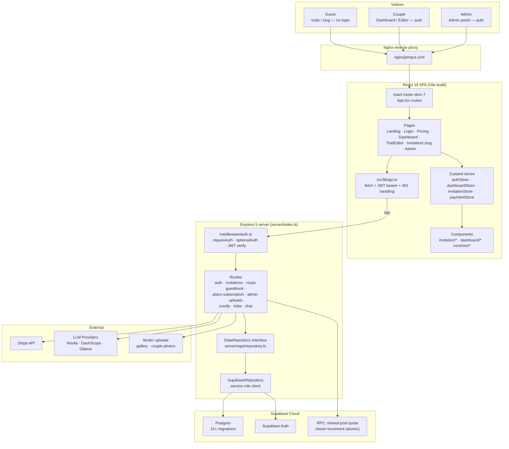
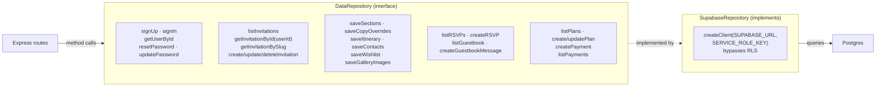
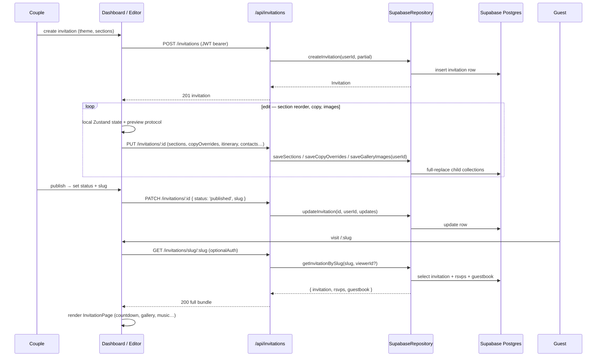
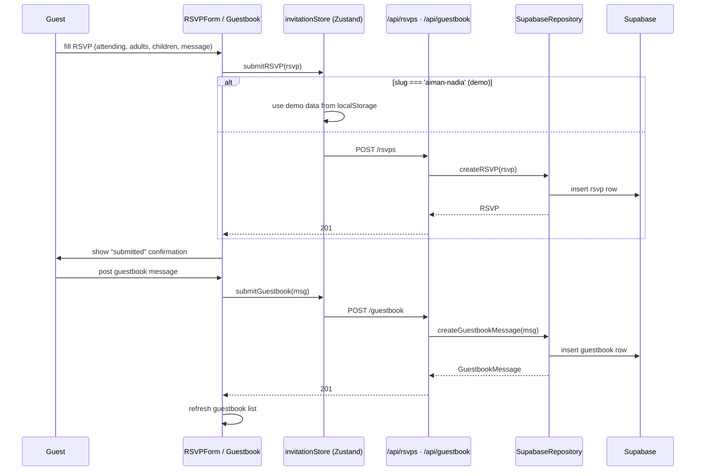
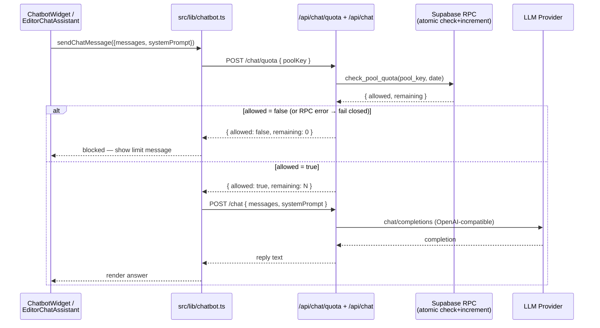
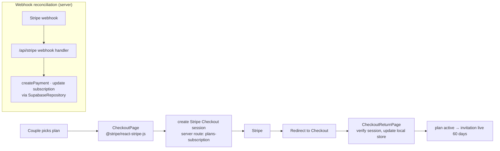
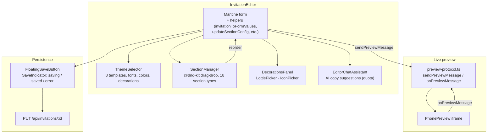
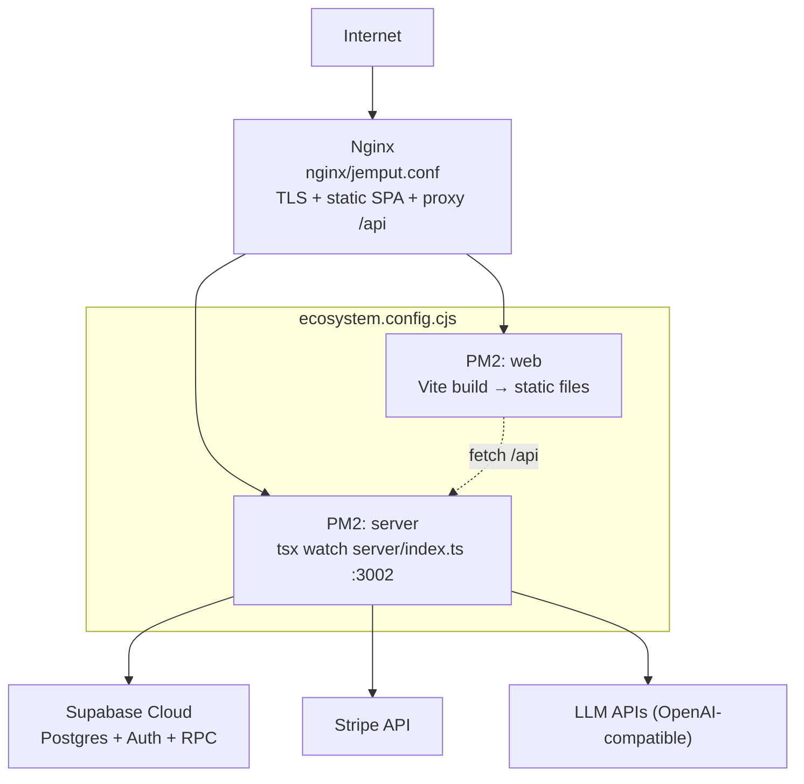

# Neyobytes Jemput — Architecture

> **Private project** — source code is not public. This document is hosted in the [`hazrid93/hazrid93`](https://github.com/hazrid93/hazrid93) profile repository so visitors can understand the architecture without needing repo access. Live site: **[jemput.neyobytes.com](https://jemput.neyobytes.com/)**

A digital wedding invitation (kad kahwin) platform for the Malaysian market. Couples sign up, build themed invitations through a drag-and-drop editor, publish them to a shareable slug (`jemput.neyobytes.com/<slug>`), and guests interact (RSVP, guestbook, AI chatbot) without an account. Stripe handles tiered subscriptions.

| | |
|---|---|
| **Frontend** | React 19 · TypeScript · Vite · React Router 7 · Mantine UI · Zustand · Framer Motion |
| **Backend** | Express 5 · TypeScript · `tsx` runtime · Helmet · rate-limit |
| **Database** | Supabase (Postgres) — service-role client, auth enforced in repository layer (not RLS) |
| **Auth** | Supabase Auth (client) + JWT issued by server (`jsonwebtoken`) · `requireAuth` / `optionalAuth` middleware |
| **Payments** | Stripe (one-time, tiered plans: Asas / Premium) · 60-day active duration |
| **AI Chatbot** | OpenAI-compatible API — Novita AI · Alibaba DashScope · Ollama · shared-pool daily quota (RPC) |
| **Editor** | `@dnd-kit` drag-and-drop · 8 theme templates · 18 section types · live phone preview · AI editor assistant |
| **Process** | PM2 (`ecosystem.config.cjs`) · Nginx (`nginx/jemput.conf`) |

---

## High-Level Architecture

---

## Repository Pattern — The DB Swap Seam

Every route handler calls methods on the `DataRepository` interface — never the Supabase client directly. Today's implementation is `SupabaseRepository`; a future `PostgresRepository` can be swapped by changing one line in `server/index.ts`. **Authorization is enforced in the repository, not in RLS** — every user-owned method takes a `userId` and filters by it.

---

## Frontend Route Map

`src/App.tsx` — lazy-loaded pages behind `ProtectedRoute` (redirects to `/login` if `authStore.user` is null once initialized).

---

## Invitation Lifecycle

---

## RSVP + Guestbook Flow (public, no login)

---

## AI Chatbot — Shared-Pool Quota

The invitation chatbot (premium) and the editor AI assistant both use a **shared-pool daily quota** enforced by an atomic Supabase RPC. The client fails **closed** — if the quota check errors, the request is blocked (never allowed through).

**Quota keys:** `invitation:<id>` for the public chatbot, `cuba_editor` / `editor` for the in-editor assistant. The daily limit is resolved server-side from `site_settings` — the client cannot inflate it.

---

## Payments & Subscription

**Plans:** Asas (free trial tier) / Premium (paid). Payment status tracked per invitation (`free` / `paid` / `expired`). Active duration: 60 days from payment.

---

## Editor Architecture

`src/components/dashboard/InvitationEditor.tsx` is the core builder. It uses a preview-protocol (`src/lib/preview-protocol.ts`) to bridge the editor form state with the live phone preview iframe.

**Trial mode:** `TrialEditorPage` (`/cuba`) stores the invitation in `localStorage` (`TRIAL_PREVIEW_STORAGE_KEY`) — no account or server round-trip needed. Demo slug `aiman-nadia` renders `demoInvitation` data, allowing the editor to be explored without signup.

---

## Data Model (key tables)

Migrations live in `supabase/` (16 numbered files). Authorization is enforced in the repository layer.

---

## Deployment Topology

*PM2 runs the Express server (`tsx`) and serves the Vite-built SPA as static files. Nginx terminates TLS, serves the SPA, and proxies `/api/*` to the server. The server talks to Supabase (service-role), Stripe, and LLM providers.*
