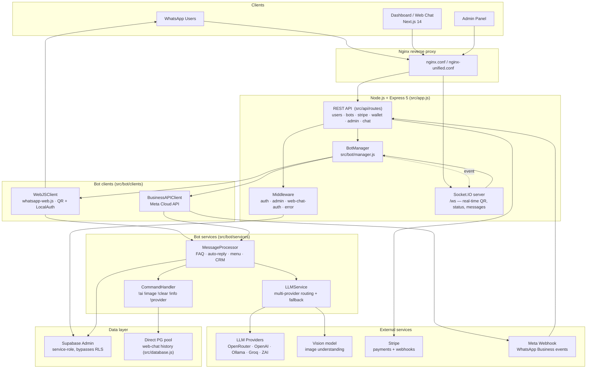
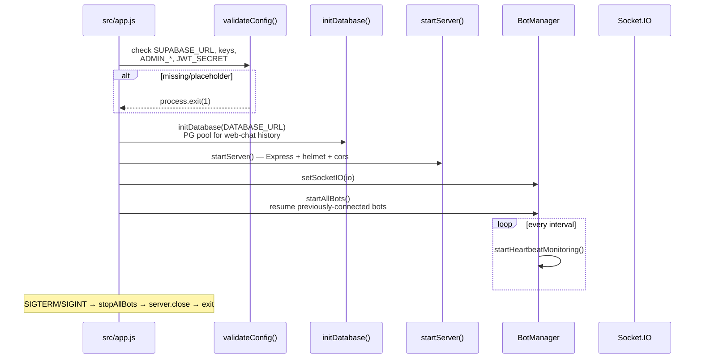
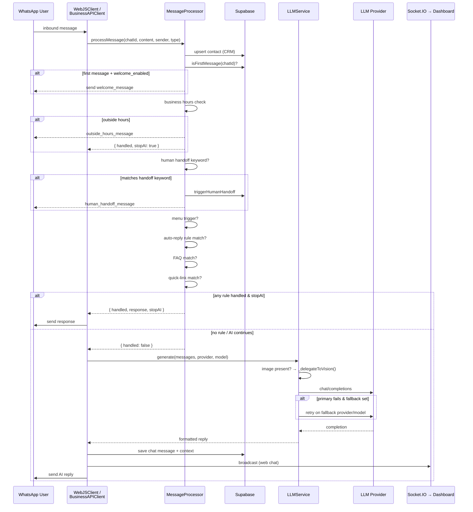
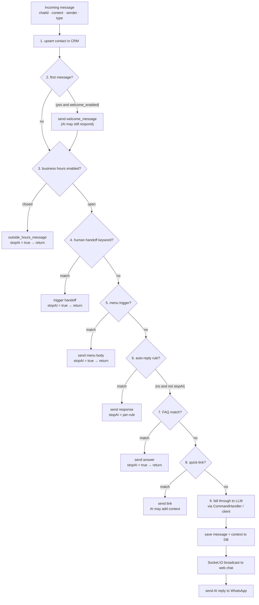
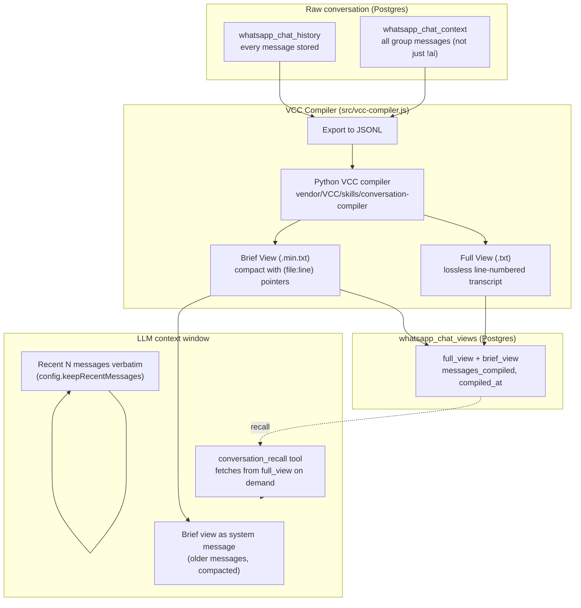
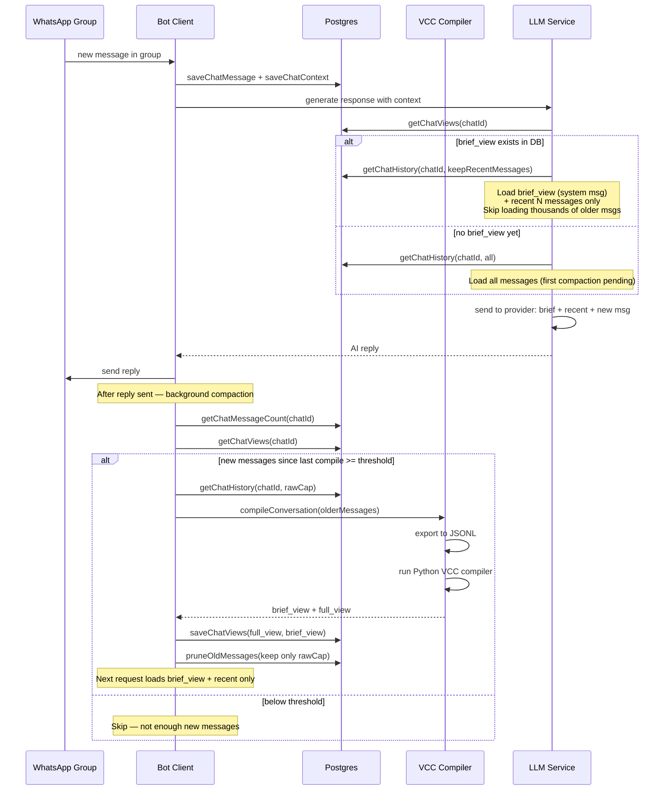
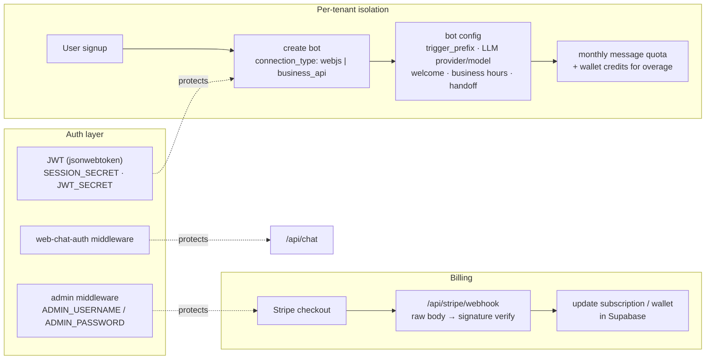
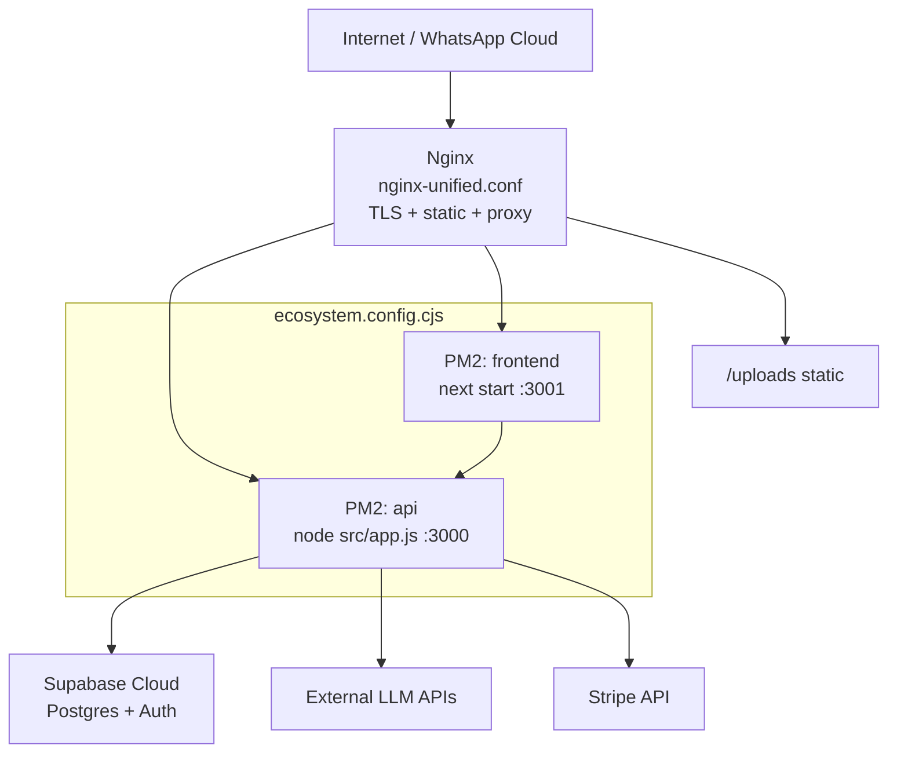

# Neyobytes WhatsApp Agent — Architecture

> **Private project** — source code is not public. This document is hosted in the [`hazrid93/hazrid93`](https://github.com/hazrid93/hazrid93) profile repository so visitors can understand the architecture without needing repo access.

A multi-tenant WhatsApp Bot SaaS platform. Users sign up, create AI-powered WhatsApp bots (via QR-code pairing or WhatsApp Business API), configure behaviour through a dashboard, and manage subscriptions/billing through Stripe.

| | |
|---|---|
| **Backend** | Node.js 18+ · Express 5 · Socket.IO · ES Modules |
| **WhatsApp** | `whatsapp-web.js` (QR pairing) · WhatsApp Business Cloud API |
| **Frontend** | Next.js 14 (App Router) · TypeScript · Supabase Auth |
| **Database** | Supabase (Postgres + RLS) · service-role + anon clients |
| **AI / LLM** | OpenRouter · OpenAI · Ollama · Groq · ZAI · plus vision delegation |
| **Payments** | Stripe (subscriptions, wallet credits, webhook reconciliation) |
| **Process** | PM2 (`ecosystem.config.cjs`) · Nginx reverse proxy |

---

## High-Level Architecture

---

## Startup & Bot Lifecycle

---

## Incoming WhatsApp Message — Full Flow

---

## Message Processor — Decision Pipeline

`src/bot/services/message-processor.js` runs every inbound message through an ordered pipeline. The first handler that sets `stopAI: true` short-circuits the AI call.

---

## Multi-Provider LLM Routing

`src/bot/services/llm-service.js` — each bot is configured with a primary provider+model and an optional fallback. Vision-capable models are detected by regex; images are delegated to a dedicated vision endpoint.

```mermaid
flowchart LR
  REQ["chat request<br/>(messages, hasImage?)"] --> CHECK{"_hasImageContent<br/>and model vision-capable?"}
  CHECK -- yes --> VISION["_delegateToVision<br/>visionProvider endpoint"]
  CHECK -- no --> PRIMARY
  VISION --> PRIMARY

  PRIMARY["getApiKey(provider)<br/>getEndpoint(provider)"] --> CALL["POST {endpoint}/chat/completions"]
  CALL --> OK{"200 OK?"}
  OK -- yes --> OUT["return completion"]
  OK --|error and fallback set|--> FB["switch to<br/>fallbackProvider + fallbackModel"]
  FB --> CALL2["POST {fallback endpoint}/chat/completions"]
  CALL2 --> OUT

  subgraph Providers["PROVIDER_ENDPOINTS"]
    P1[openrouter]
    P2[openai]
    P3["ollama — local"]
    P4["zai / bigmodel"]
    P5[synthetic]
    P6["firepass / fireworks"]
    P7[crofai]
    P8[waferai]
    P9[neuralwatt]
    P10[opencodego]
    P11[routingrun]
    P12[chatgpt gateway]
  end
  PRIMARY -.select.-> Providers
```

---

## 🧠 Context Management & VCC Compaction

WhatsApp group chats can run for thousands of messages. Sending all of them to the LLM on every turn would blow past context windows and cost a fortune. The platform solves this with a **View-oriented Conversation Compiler (VCC)** — a two-tier compaction system that gives the LLM access to long group conversation history **without bloating the context window**.

### How it works

The system maintains **two views** of every conversation:

| View | Purpose | Injected into LLM? |
|---|---|---|
| **Full View** | Lossless, line-numbered transcript — the canonical source for recall | No (stored in DB, retrieved on demand) |
| **Brief View** | Compact view with `(file:line-range)` pointers back to Full View | Yes — replaces thousands of messages with a few hundred lines |

The LLM context window receives only: **brief view (older messages) + recent N messages (verbatim)**. The full conversation is never lost — the `conversation_recall` tool lets the LLM fetch specific line ranges or search the Full View on demand.

### Compaction flow

### Why this is awesome

**The problem:** A 2000-message group chat would consume the entire context window of most LLMs — leaving no room for the actual response, and costing 100k+ tokens per turn. Naive summarization loses detail permanently.

**The VCC solution:**

1. **Lossless recall** — nothing is ever deleted from the Full View. The LLM can retrieve exact words from message #47 using `conversation_recall` with line references. Older messages are compacted in the Brief View, but the Full View preserves them byte-for-byte.

2. **Brief View with line pointers** — the compact view replaces verbose messages with truncated summaries, but each entry carries a `(file:line-range)` pointer back to the Full View. The LLM sees "user asked about pricing (truncated from #abc.txt:218-226)" and can fetch lines 218-226 if it needs the full text.

3. **DB-driven compaction** — VCC always compiles from **raw DB messages**, never from a previous brief view. This prevents compaction drift: re-compiling always starts from the original source, so the Full View stays canonical.

4. **Background, non-blocking** — compaction runs via `setImmediate` after the reply is sent. The user never waits for compaction; it happens asynchronously.

5. **Triggered by DB freshness, not memory** — the auto-trigger checks how many new raw DB messages exist since the last compile (`rawMessageCount - compiledCount >= threshold`), not the in-memory context length. This is correct because the in-memory history may already be compacted.

6. **In-memory compile cache** — `compileConversation` caches results by SHA-256 hash of the message content + truncation params. If the same messages are compiled again (e.g. rapid messages), the cache returns instantly.

7. **Group context beyond !ai** — `whatsapp_chat_context` stores **all** group messages (not just `!ai` interactions), so the LLM has awareness of the full group conversation, not just the turns where it was invoked.

### Database tables involved

| Table | Purpose |
|---|---|
| `whatsapp_chat_history` | Every `!ai` interaction (user + assistant), with images and mentions |
| `whatsapp_chat_context` | All group messages (not just AI) — for full group awareness |
| `whatsapp_chat_views` | VCC compiled `full_view` + `brief_view`, `messages_compiled` count |
| `whatsapp_chat_summaries` | Legacy summaries table (replaced by `chat_views`) |
| `whatsapp_group_members` | Group participant names for sender attribution |
| `whatsapp_unlocked_groups` | Groups where the bot is active (AI responds to all messages) |

### Configuration

| Setting | Default | Effect |
|---|---|---|
| `summarizationEnabled` | true | Enable VCC compaction |
| `summarizeAfterMessages` | configurable | Auto-compact threshold (new messages since last compile) |
| `keepRecentMessages` | configurable | N recent messages kept verbatim in context |
| `alwayslogMaxMessagesPerChat` | 1000 | Raw DB row cap per chat (hard cap 50000) |
| `alwayslogContextLimit` | 200 | Group context messages fetched for VCC input |

Manual compaction is also available via the `!compact` command (owner-only), which forces a VCC compilation regardless of the auto-trigger threshold.

---

## API Surface

`src/api/routes/index.js` mounts everything under `/api`:

| Route | Controller | Purpose |
|---|---|---|
| `/api/users` | `users.js` | signup, auth, profile |
| `/api/bots` | `bots.js` + `bot-features.js` | create/list bots, FAQ, auto-replies, menus, contacts, quick-links |
| `/api/stripe` | `stripe.js` | checkout, wallet top-up, **webhook** (raw body) |
| `/api/admin` | `admin.js` | user/plan/pricing/settings management (admin middleware) |
| `/api/messages` | `messages.js` | chat history, context |
| `/api/wallet` | `wallet.js` | credits, transactions |
| `/api/chat` | `web-chat.js` | public web chat interface |
| `/api/whatsapp/webhook/meta` | `meta-webhook.js` | Meta Business webhook (no auth) |

**Web chat** runs over Socket.IO on path `/ws`, authenticated via JWT from the handshake. File uploads go through `multer` (images only, 10 MB) into `uploads/<chatId>/`.

---

## Data Layer

- **`src/database/supabase.js`** — three clients:
  - `supabaseAdmin` — service-role key, bypasses RLS (server-side writes)
  - `supabaseAnon` — anon key, respects RLS (client-side reads)
  - `createUserClient(token)` — per-user token for RLS-scoped queries
- **`src/database.js`** — direct `pg` pool for web-chat history (separate from Supabase-managed tables)
- Schema files: `schema.sql`, `schema-wallet.sql`, `schema-enhanced-config.sql`, `schema-business-api.sql`

---

## Multi-Tenancy & Security

---

## Deployment Topology

*PM2 manages two processes — the Express API and the Next.js frontend. Nginx fronts both, serves uploaded files, and terminates TLS.*
